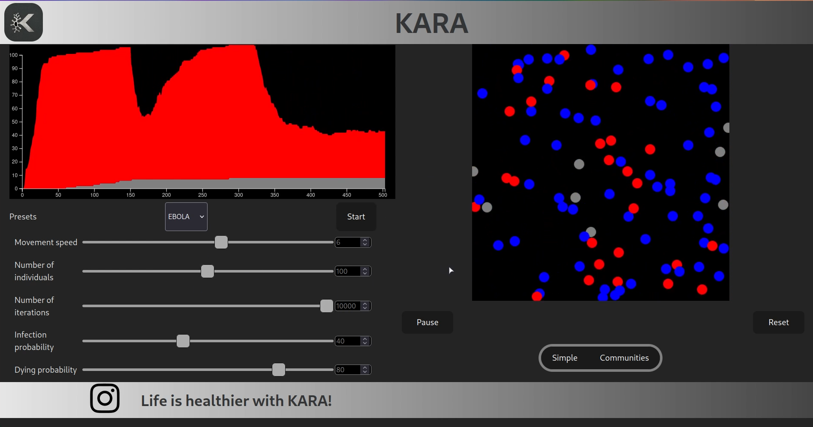

# Infection spreading simulation
This is a project that permits to visualise on a map the spreading of an infection based on different parameters.

# Web architecture
Connection between backend and frontend is done by a websocket connection, server is sending data about each point on map, including it's current state (alive|infected).
# Frontend
Written in React.js. application is recieving data about individuals and perform all necessary calculations to display them on graph and on map
## Map
Map is drew using canvas
## Graph
Stacked graph was implemented using D3.js library 
# Backend
Server written in Rust using tokio library
# Algorithm
Algorithm can be found here [link](backend/src/algorithm.rs)
# Docker
Backend and frontend have their own Docker files that are chained together using docker compose. **Project is ready to be deployed on a server**